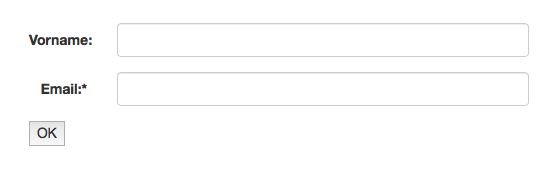

# Quickstart


## Add dependency

Add this dependency to your project:

```xml
...
<dependency>
    <groupId>de.cyclon-softworx</groupId>
    <artifactId>jformchecker</artifactId>
    <version>0.1.7</version> <!-- Please check for the latest version on maven central or in the changelog! -->
</dependency>
...
```

## Define a form

Write a class, that extends FormCheckerForm and add some fields to it:


```Java

public class MyForm extends FormCheckerForm {

  @Override
  public void init() {
    // Textfield for firstname
    add(TextInput.build("firstname")
      .setDescription("Firstname"));

    // Textfield with email validation and required
    add(TextInput.build("email")
      .setDescription("Email")
      .setRequired()
      .setCriterias(Criteria.emailAddress()));
    
    // Add more FormElements here...
  }
}
```


## Controller

Write a controller, that uses this form: (Here Spring MVC)

```Java

  @RequestMapping("/form")
  public String intro(HttpServletRequest request, Model model) {
    FormChecker fc = FormChecker.build(
        (key) -> request.getParameter(key), 
        new MyForm()
      )
     .run();
    
    model.addAttribute("fc", fc.getView());
    if (fc.isValidAndNotFirstRun()) {
      System.out.println("Valid email from form:"  + fc.getValue("email"));
    }
    return "index";
  }

```


## Template

Output the form within your template.


```html
...
<h1>The form</h1>

${fc.form}

...
```


## Output




## Go on

[Documentation](start.md)

[Read about the concepts](concepts.md)

[Read the changelog](CHANGELOG.md)
