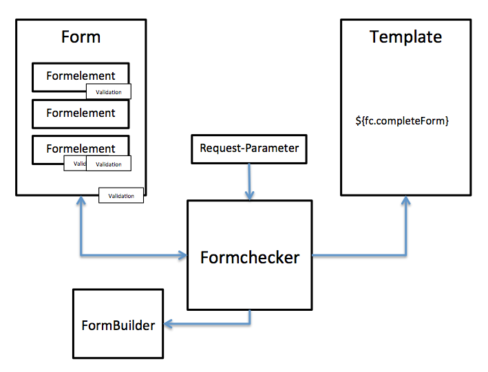

# jFormChecker documentation

Check out, how to use jFormchecker in your projects. 


## Concept

Implement your webforms with these ingredients:

* A form with form elements
* A controller with a Formchecker instance
* An indidividual FormBuilder Class
* A Template with a formchecker-call

The FormCheckerForm-Class defines the form with the form-elements.
There are a number of prebuild form-elements that should be enough to do the basic work.
Each form-element can have validations. The form can have a form-validator too. 

The FormCheckerForm is passed to the Formchecker. The formchecker prefills the form, triggers the validators and decides, if it is valid.

The Formbuilder renders the form to html. 

The template just makes a call to the formbuilder which returns the html for the form.





## The Form

The Form is a class of type FormCheckerForm. Fill this class within the "init" method with the form-elements. This class holds every "moving" data.

Typical usage:

```Java

public class MyForm extends FormCheckerForm {

  public void init() {
  	 // Add a Textinputfield where you can enter your firstname
     add(TextInput.build("firstname").
     	setDescription("Your Firstname"));

  	 // Add a Textinputfield where you can enter your lastname
    add(TextInput.build("lastname").
    	setDescription("Your lastname:"));
	}
}
```


## The Formelements

The Formelements represent the input-fields for your form.

There is a large value of prebuild Formelements:

* Text

* Radio

* Checkbox

* FileUpload

* Password

* Select

* Date-Input (complex input that makes sure, that you get a valid date)

You can build your own Formelements, by extending from  AbstractInput and implementing FormCheckerElement.

Most important methods to overload:

```Java

public ExampleInput extends AbstractInput<ExampleInput> implements FormCheckerElement {

	public static ExampleInput build(String name, String moreParams) {
		ExampleInput e = new ExampleInput();
		e.setParam(moreParams);
		return e;
	}

	@Override
	public String getInputTag(Map<String, String> attributes) {
		return  "<example Input>";

	}
	
	// ...

} 


```
